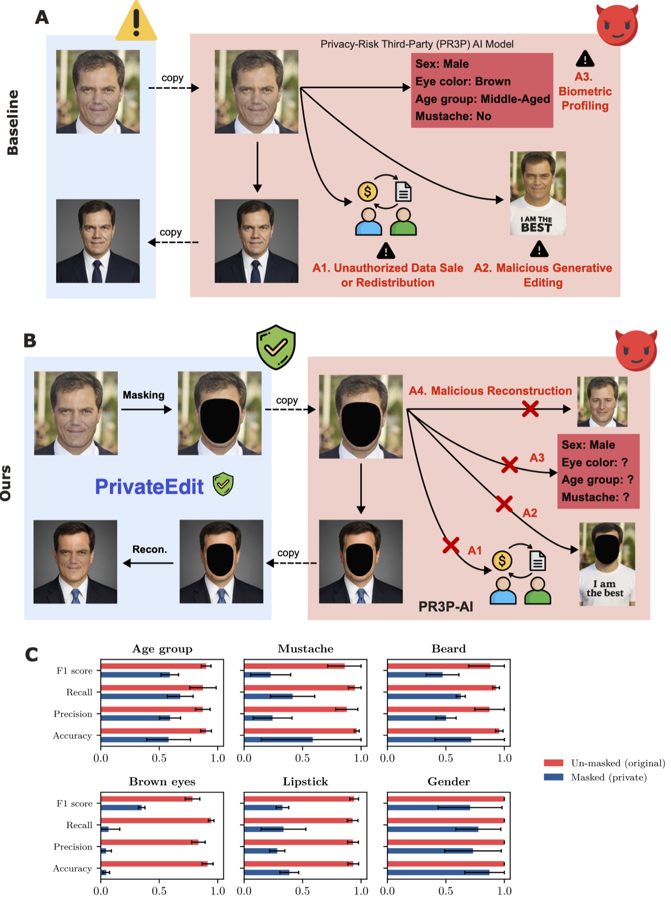

<div align="center">

# 🔒 PrivateEdit: A Privacy-Preserving Pipeline for Face-Centric Generative Image Editing

**Edit your photos with powerful cloud AI — without ever exposing your face.**

Dipesh Tamboli · Vineet Punyamoorty · Atharv Pawar · Vaneet Aggarwal

_IEEE Transactions on Artificial Intelligence (TAI), 2026_

[](https://arxiv.org/abs/2603.03412)
[](https://ieeexplore.ieee.org/document/11422932)
[](https://dipeshtamboli.github.io/media.html)
[](#-code-availability--license)



<em>Cloud generative-editing today forces you to upload your real face (A), exposing you to biometric profiling, resale, and misuse. PrivateEdit (B) masks your identity on-device before anything leaves the phone — and (C) collapses attribute-inference accuracy to near-random.</em>

</div>

---

## 🎥 Demo


*The PrivateEdit desktop app, end-to-end (clip is sped up): **open** a photo → **mask** the face on-device → have a **third party** turn the masked image into a professional headshot (the real face is never exposed) → **re-inject** the original identity locally. ▶ [Full video](assets/PrivateEdit-Demo.mp4).*

## 💡 TL;DR

Modern generative-editing workflows (professional headshots, retouching, style transfer) require uploading a **high-fidelity image of your face** to untrusted third-party cloud APIs. **PrivateEdit** is a **modular, on-device pipeline** that lets you use those same black-box APIs **without ever transmitting your biometric identity**. It splits each image into an **Editable Context** (sent to the cloud) and an **Identity Core** (kept on-device), then re-integrates your identity locally after editing.

## ⚠️ The problem: the biometric-disclosure tradeoff

As shown in panel **(A)** of the figure above, uploading your face to a **Privacy-Risk Third-Party (PR3P)** model exposes you to:

- **Biometric profiling** — unauthorized inference of sex, eye color, age, and other traits.
- **Unauthorized data sale** — redistribution of sensitive biometric data.
- **Malicious generative editing** — misuse of your likeness for unintended purposes.

## 🛡️ The PrivateEdit pipeline

PrivateEdit enforces **privacy-by-design** (panel **(B)**): lightweight on-device masking neutralizes sensitive facial features *before* they reach any PR3P model, blocking profiling and identity reconstruction while preserving professional-grade editing utility.

**1 · On-device masking (upstream)** — a lightweight network detects facial landmarks and generates a mask over the inner-face region; those pixels are replaced with a constant/noise. The transmitted image keeps clothing and background but carries **zero** biometric facial data.

**2 · Cloud-based generative editing** — the masked image goes to any third-party API with a prompt (e.g. *"make a professional headshot"*). **Model-agnostic** and black-box: no retraining needed. The model synthesizes attire/background and hallucinates a generic face in the masked region.

**3 · Local reintegration (downstream)** — the returned image is composited **on-device**: the original facial pixels are geometrically aligned and seamlessly blended back into the newly edited context, restoring identity.

## 📊 Results

**Privacy (panel C above).** Across foundation models, masking collapses sensitive-attribute inference — age group, mustache, beard, eye color, lipstick, gender — from high accuracy on the un-masked image toward **near-random** on the masked one, reducing attribute inference by **over 50%** against models like Gemini, Grok, and LLaMA.

**Utility & identity preservation.** PrivateEdit produces professional edits *and* faithfully restores identity — the best FID and by far the highest identity (cosine) similarity versus the "no-privacy" and naive-reconstruction baselines:

<div align="center">

</div>

<div align="center"><em>Same subject and prompt. The cloud-only baselines drift to a different person; PrivateEdit's local face-reintegration keeps the original identity (high cosine similarity, low FID).</em></div>

## ✨ Key features

- **Zero-trust architecture** — the cloud provider never sees your real biometric identity.
- **Tunable privacy** — an adjustable **mask ratio** trades off privacy vs. output fidelity.
- **Model-agnostic** — works with any black-box editing API; no retraining or model access required.
- **Attribute obfuscation** — reduces attribute inference (age, eye color, mustache, …) by **>50%** against SOTA models.

## 🔗 Links

- 📄 **Paper:** [arXiv:2603.03412](https://arxiv.org/abs/2603.03412) · [IEEE Xplore](https://ieeexplore.ieee.org/document/11422932)
- 📰 **In the news:** [media coverage](https://dipeshtamboli.github.io/media.html)

## 🔒 Code availability & license

> **The PrivateEdit method is patent-pending, and the source code is _not_ being released.**
> This repository is a reference for the paper and its results — it does not include an implementation, and **no open-source license or rights are granted** (all rights reserved). Please refer to the [paper](https://arxiv.org/abs/2603.03412) for the full method, and cite it if you build on this work. For research inquiries, contact the authors.

## 📚 Citation

```bibtex
@article{tamboli2026privateedit,
  title   = {PrivateEdit: A Privacy-Preserving Pipeline for Face-Centric Generative Image Editing},
  author  = {Tamboli, Dipesh and Punyamoorty, Vineet and Pawar, Atharv and Aggarwal, Vaneet},
  journal = {IEEE Transactions on Artificial Intelligence},
  year    = {2026}
}
```
